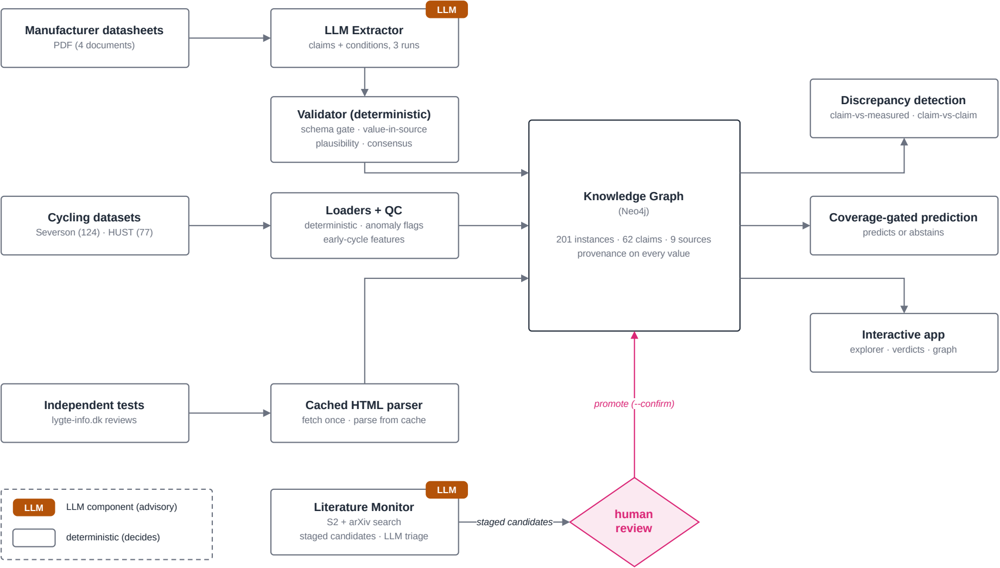

<div align="center">

# 🔋 BatteryKG

### Reconciling What Battery Makers Promise with What Independent Tests Measure — a Provenance-Tracked Knowledge Graph with Prediction that Knows When to Refuse

[](https://www.python.org/downloads/)
[](https://docs.docker.com/compose/)
[](https://batterykg.streamlit.app)

[🌐 Live Demo](https://batterykg.streamlit.app) · [🎥 Video](https://youtu.be/Fkcdzemw5b0) · [📄 Paper](#paper)



*Three deliberately conflicting sources — datasheet claims, cycling measurements, independent tests — reconciled in one provenance-tracked graph. LLM components are advisory; deterministic code and a human gate decide.*

</div>

---

## 📖 Overview

BatteryKG builds a knowledge graph of commercial battery cells from
deliberately conflicting sources — manufacturer datasheet **claims**, cycling
dataset **measurements**, and independent tests — and reconciles them with
full provenance. On top of the graph, a coverage-gated model predicts cycle
life for unseen cells and **abstains** when the graph neighborhood is too
sparse to trust; an LLM pipeline keeps the claim side updatable from new
documents without ever writing to the graph unreviewed.

| Component | Description |
|-----------|-------------|
| 🧠 **Knowledge Graph** | Neo4j; datasheet claims + cycling measurements + independent tests, full provenance on every value |
| 🎯 **Coverage-Gated Prediction** | XGBoost + graph-neighbor features; abstains below the data-support threshold instead of guessing |
| 🤖 **Validated LLM Extraction** | Llama-3.3-70B, 3-run consensus + deterministic validator — zero unsourced values reach the graph |

## 📈 Key Results

| Dimension | Result |
|---|---|
| Cycle-life prediction | RMSE **135 vs 141 cycles** (graph vs baseline, n.s.) |
| Abstention | **cuts retained RMSE by ~40% at 60% retention (135 → 79 cycles)**; zero-shot on HUST refuses all **77** cells (**~83% error avoided**) |
| Claim extraction | F1 **0.70 → 0.78** with **zero unsourced values** |
| Spec consistency | **14 of 43** cross-document comparisons conflict |

## 🕹️ Interactive Demo

Three pages to play with at [batterykg.streamlit.app](https://batterykg.streamlit.app):

| Page | What you can do |
|---|---|
| 🔋 **Will It Last?** | Design a fast-charging recipe and get a cycle-life prediction — or an honest refusal |
| ⚖️ **Promise vs Reality** | The datasheet's cycle-life claim drawn over how long the cells actually lasted |
| 🔍 **Who Is Lying?** | Official spec sheets for the same battery that disagree with each other |

## Paper

> *Reconciling Manufacturer Claims with Measured Degradation: A Self-Updating
> Knowledge-Graph Multi-Agent System for Trustworthy Battery Cell Life
> Prediction.* Under review at **Batteries** (MDPI).
> Citation and DOI will be added on publication.

## Quickstart

Requires Docker and Python ≥ 3.11.

```bash
# 1. Credentials (no defaults ship — set your own Neo4j password)
cp .env.example .env         # edit NEO4J_PASSWORD

# 2. Start Neo4j (and optionally the app) — http://localhost:7474
docker compose up -d neo4j

# 3. Python environment
python -m venv .venv && source .venv/bin/activate
pip install -r requirements.txt        # requirements.lock.txt has exact pins

# 4. Data + KG load pipeline (reproducible, no manual steps)
python -m src.ingestion.download all   # raw datasets, ~8.6 GB, resumable
python -m src.ingestion.build_all      # tidy Parquet -> data/processed/
python -m src.ingestion.features       # early-cycle features
python -m src.kg.load                  # cells/measurements + SIMILAR_TO edges -> Neo4j
python -m src.kg.coverage              # graph-coverage metrics on the edges
python -m src.kg.claims                # gold-standard claims -> Neo4j
python -m src.kg.discrepancy           # claim-vs-measured verdicts
python -m src.ingestion.lygte          # fetch + parse lygte-info.dk independent tests
python -m src.kg.independent           # third source -> Neo4j (reconciliation panel)

# 5. Demo app — http://localhost:8501
streamlit run app/main.py
```

The trained serving artifacts ship in `app/artifacts/`, so the **Will It
Last** prediction page works immediately after step 3. The graph pages run
either against a live Neo4j (steps above) or, with no database at all, from
the bundled read-only snapshot in `data/kg_snapshots/app_snapshot.json` —
cached Neo4j query results recorded from the live graph (regenerate with
`scripts/gen_app_snapshot.py`). The hosted demo runs in this snapshot mode.
Alternatively `docker compose up --build` runs the full stack (Neo4j + app)
in containers. Every page follows an honesty rule: numbers come from the
graph, the artifacts, or a report file — when a source is unavailable the
page says so instead of mocking data.

## Released gold standard

`data/claims/` is a citable contribution of the paper:

- `*.yaml` — hand-extracted manufacturer claims for the A123 APR18650M1A
  (LFP), Panasonic NCR18650B (NCA), and LG 18650HG2 (NMC), with unit, page
  number, and the datasheet's *stated conditions* per claim (an explicitly
  recorded `"unspecified"` when the datasheet states none — that omission is
  itself a finding). Format and property vocabulary: `data/claims/README.md`.
- `data/gold/*.yaml` — the same, for the **held-out** Samsung SDI INR18650-25R
  (41 claims), annotated after the extraction prompt, the property vocabulary
  and the Validator's bounds were frozen, and read only at scoring time
  (experiment 11).

The manufacturer PDFs themselves are copyrighted and are not redistributed;
source URLs and retrieval dates are in `data/README.md`. The extraction-input
text snapshots (`data/claims/extracted_text/`) are likewise not redistributed —
they are regenerated from the publicly available datasheet PDFs via the
ingestion script: download the PDFs to `data/claims/datasheets/` (URLs in
`data/README.md`), then run `python -m src.agents.pdf_text`.

## Repository structure

```
src/ingestion/   dataset loaders (Severson/MIT, Sandia, HUST, lygte parser), features, QC
src/kg/          Neo4j schema, loaders, SIMILAR_TO graph features, discrepancy detection
src/models/      graph-mediated predictor, graph-free baseline, coverage-gated abstention
src/agents/      LLM claim extraction, validator, literature monitor (human-gated)
src/viz/         publication figure scripts
app/             Streamlit demo (4 pages) + trained serving artifacts
experiments/     experiments 05-11 (see below); 01-04 live in src/models/
tests/           full suite; fixtures stand in for network/copyrighted sources
data/claims/     released gold standard (see above)
data/gold/       held-out gold standard for experiment 11
data/README.md   provenance for every dataset (URLs, download dates)
```

## Repo map — what produces what

Shipped artifacts and the script that regenerates each:

| shipped file | produced by |
|---|---|
| `app/artifacts/*` (models, meta, neighbor bank) | `python -m src.models.train_final` |
| `outputs/experiment_01_prediction.md` | `python -m src.models.experiment_01` (prediction + abstention study) |
| `outputs/experiment_02_extraction.md` | `python -m src.agents.experiment_02` / `experiment_02b` (LLM claim extraction vs. gold standard; needs `GROQ_API_KEY`) |
| `data/eval/questions.jsonl` | `python -m src.agents.experiment_03` (one spec question per gold claim; shipped so the eval is exactly reproducible) |
| `data/kg_snapshots/severson_edges_publication.json` | frozen export of the Severson `SIMILAR_TO` edge lists from the publication KG; read by `src/viz/make_paper_figures.py` so the figures rebuild without a live database |
| `data/kg_snapshots/app_snapshot.json` | `python -m scripts.gen_app_snapshot` against a live KG (recorded query results that power the app's no-database snapshot mode) |
| `data/claims/README.md` vocabulary table | `python scripts/gen_claims_vocab.py` (derived from the YAMLs in `data/claims/` and `data/gold/`) || `outputs/experiment_06_quantile_gate/` | `python -m experiments.exp06_quantile_gate.in_study` / `.hust_adaptation` / `.summarize` |
| `outputs/experiment_07_revision_extras/` | `python -m experiments.exp07_revision_extras.cost_sensitive` / `.survival` / `.target_sensitivity` / `.summarize` |
| `outputs/experiment_08_snl_ingestion/` | the `experiments.exp08_snl_ingestion.*` pipeline (needs Neo4j + the archive zip) |
| `outputs/experiment_09_attia_feasibility/` | `python -m experiments.exp09_attia_feasibility.attia` / `.adaptation` / `.partial_acceptance` |
| `experiments/exp11_heldout_samsung/results.json` | `python -m experiments.exp11_heldout_samsung.rescore` (no LLM calls) |
| `paper/tables/*.tex`, `paper/figures/*` | written on demand by the experiment above that owns each; the manuscript itself is not part of this repository |


## Revision experiments

Experiments 05–11 back the major revision. Each is a package under
`experiments/`; every one writes a `README.md` next to its outputs.

| | what it establishes | what it needs |
|---|---|---|
| **05** | the absolute coverage gate cannot transfer: its threshold is a distance in Severson's z-scored scaling, not a sample-size problem | Severson + HUST downloads |
| **06** | the quantile-referenced gate that replaced it — retain when coverage reaches the q=41 percentile of the bank's own leave-one-out distribution, which reproduces the 60 % operating point and is scale-free | Severson + HUST downloads |
| **07** | cost-sensitive choice of the operating point, Kaplan-Meier survival of the cells, and sensitivity of the conclusions to the 60 % target | Severson download |
| **08** | an independent measurement source (Sandia/BatteryArchive, 30 cells of a cell the graph already knew) taken end to end through the system's own update path — registration, promotion, staging, entity resolution, load, coverage, discrepancy | live Neo4j **and** `SNL LFP.zip` (see `data/README.md` §6) |
| **09** | the hardest honest test of the gate: same cell and laboratory as Severson, charge protocols the bank has never seen | `python -m src.ingestion.download attia` (~2.4 GiB) |
| **10** | the Section 4.4 comparability verdicts re-derived independently, without calling the code that produced them (read-only) | live Neo4j with the KG loaded |
| **11** | held-out extraction on a datasheet that contributed nothing to the prompt, the vocabulary or the Validator: precise (0.875) and hallucinating nothing, but recovering 34 % of the gold | nothing — scores the frozen predictions; see below |

Experiment 08 cannot be re-run without the archive zip, so its summary in
`outputs/experiment_08_snl_ingestion/README.md` ships as the evidence.

Experiment 11's re-score runs against shipped artifacts. Its text snapshot is
derived from a copyrighted datasheet and is not redistributed, so by default the
script reports the value-stage metrics — which do not read the document — and
marks the hallucination count and Validator replay **unavailable** rather than
guessing them. For the complete re-score, rebuild the snapshot first (see
*Released gold standard* above).

## Tests

```bash
pytest -q
```

Tests requiring a live Neo4j or unbuilt local data skip with an explicit
reason; everything else runs self-contained from shipped fixtures.

## License

MIT — see [LICENSE](LICENSE). Third-party datasets retain their own licenses
(sources in `data/README.md`); `data/hust_discharge_rates.json` is vendored
from BatteryML (MIT).
